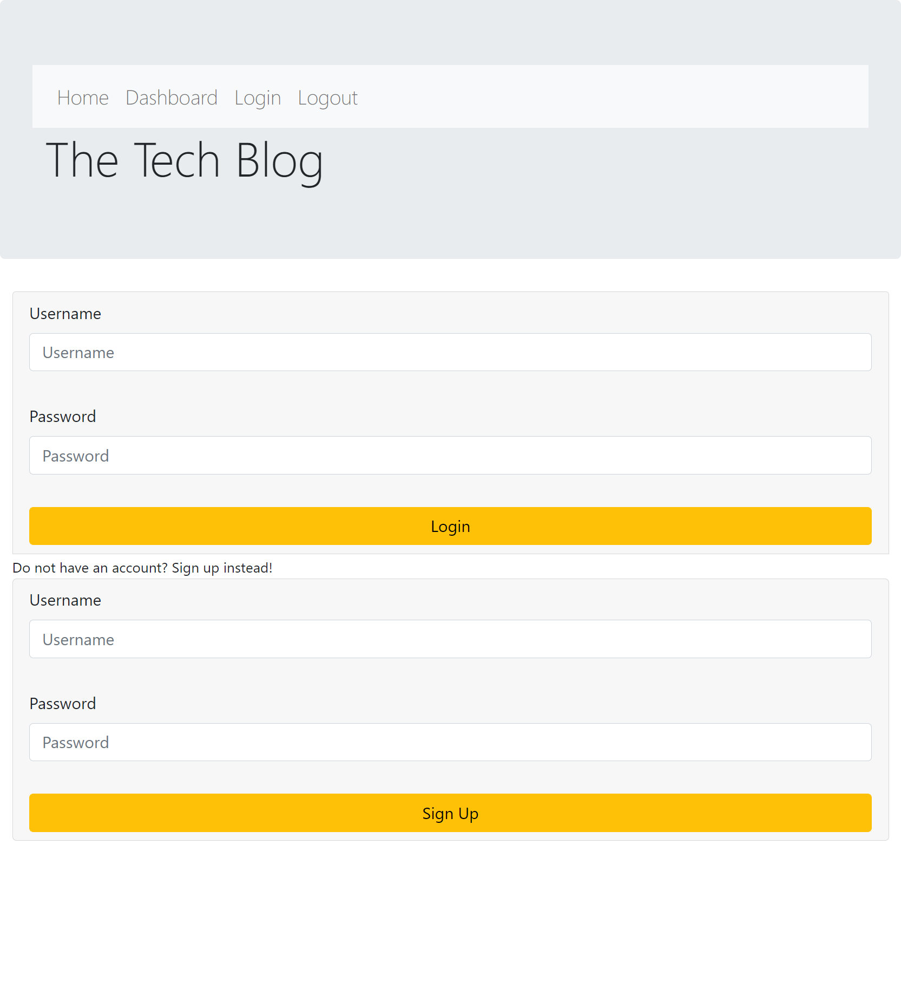
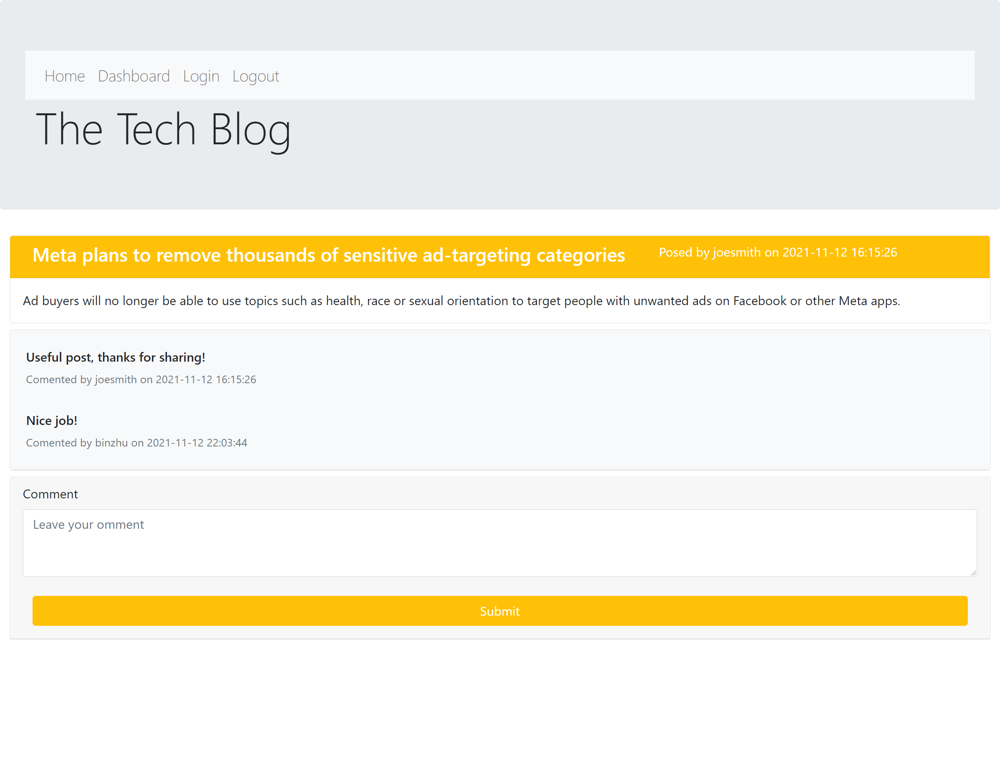

# Tech Blog

## Description

This is a CMS-style blog that allows you to publish articles, blog posts, and your own thoughts and opinions. This app follows the MVC paradigm in its architectural structure, using `Handlebars.js` as the templating language, `Sequeliz`e as the ORM, and the `express-session` npm package for authentication.

## Usage Instructions

Simply use deployed link https://sherrytechblog.herokuapp.com/ to create your account, then add your new tech blog and reading other users' blogs.

## License

[The MIT License](https://opensource.org/licenses/MIT)

Permission is hereby granted, free of charge, to any person obtaining a copy of this software and associated documentation files (the "Software"), to deal in the Software without restriction, including without limitation the rights to use, copy, modify, merge, publish, distribute, sublicense, and/or sell copies of the Software, and to permit persons to whom the Software is furnished to do so, subject to the following conditions: The above copyright notice and this permission notice shall be included in all copies or substantial portions of the Software.

## Question

Feel free to contact me at: 

*GitHub*: https://github.com/sherryzheng2018

*Email*: sherryzheng2018@gmail.com

